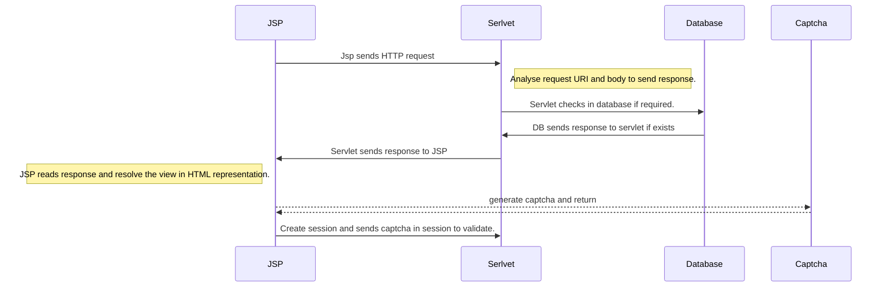

# manjunath-n-aralagun

Library college web project is college project

# Queries by :
1. What concepts used in project development ?
Ans : Used Java programming language to develop the project concepts from java Servlet, JSP, IO & JDBC. Which clearly demonstrate 
- how I can read file or property file from location
- how I connect to database to read, write and delete data from database.
- how I handle HTTP request and response demonstration.
- how I display data from response object.
- how I validate user credentials and captcha concept.
- how I handle books in ordered representation
2. 
3. 

# Developed 
- Programing - Java 11
- Database - mariaDB ( extended version of mysql)
- concepts used - Servlet, JSP and basic java knowledge

# working

